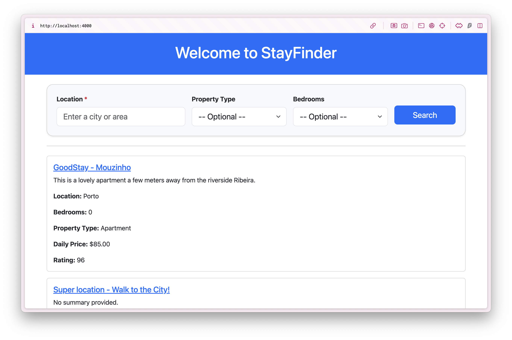
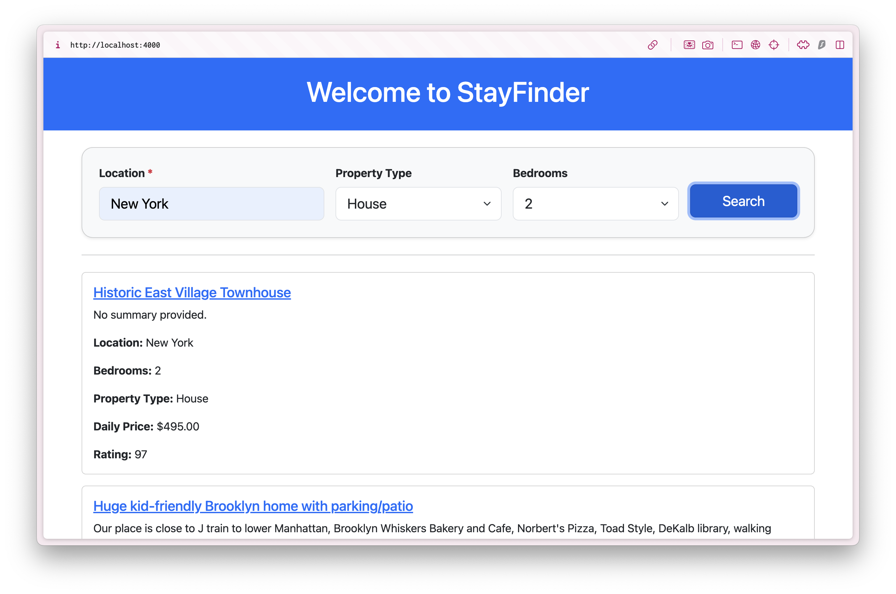
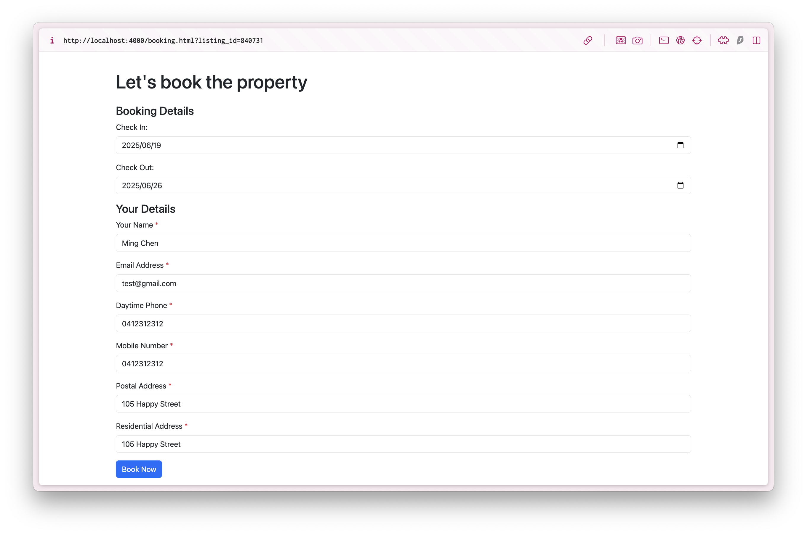
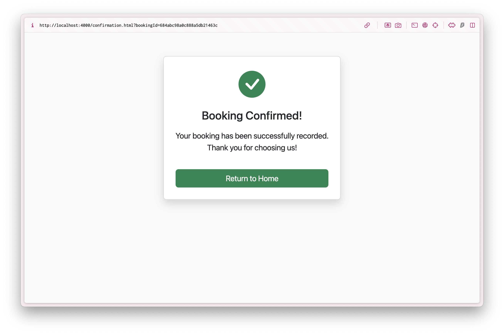

# StayFinder Booking System<br>(Node.js + MongoDB Web Application)

StayFinder is a simple web app for browsing Airbnb property listings and making bookings, powered by Node.js, Express, and MongoDB Atlas.

---

## 🔧 Tech Stack

- [Node.js](https://nodejs.org/)
- [Express.js](https://expressjs.com/)
- [MongoDB Atlas](https://www.mongodb.com/atlas)
- [dotenv](https://www.npmjs.com/package/dotenv)
- [Bootstrap 5.3](https://getbootstrap.com/docs/5.3/getting-started/introduction/)
- [Vanilla JavaScript (ES6)](https://developer.mozilla.org/en-US/docs/Web/JavaScript)
- [HTML](https://developer.mozilla.org/en-US/docs/Web/HTML) / [CSS](https://developer.mozilla.org/en-US/docs/Web/CSS)

---

## 📚 Key Features

- Browse a list of Airbnb property
- Filter by location, property type or bedroom number.
- View detailed listing cards with property name, location, daily price, property type, bedrooms and review rating.
- Submit booking form with validation
- Store booking data in MongoDB
- Display booking confirmation page after successful submission

---

## ▶️ How to Run

This app runs on your local machine using Node.js and MongoDB Atlas.

### Step 1: Download and open the project

- Clone the repo or download ZIP
- Open the folder in your terminal or code editor

### Step 2: Install dependencies

```
npm install
```
This will automatically install all required packages listed in `package.json`

### Step 3: Start the server

```
npm run dev
```
Open your browser at: http://localhost:4000


---

## 📸 Screenshots

### Home page




### Filter and result display




### Booking page




### Confirmation page




---

## 🗂️ Project Structure

- `public/` – Static frontend files
  - `index.html`, `booking.html`, `confirmation.html` – Web pages for search, booking, and confirmation
  - `index.js`, `booking.js` – Frontend JavaScript to handle form submissions and data rendering
- `routes/` – Backend API routes
  - `listings.js` – Handle search and listing queries from MongoDB
  - `bookings.js` – Handle booking submissions and store to database

- `server.js` – Main Express server file

- `.env` – Environment config (MongoDB connection string)

- `package.json` – Project dependencies and scripts

- `README.md` – Project documentation and setup instructions

---

## 🧠 What I Learned

- Built a full-stack CRUD web app using Node.js and MongoDB
- Used RESTful API routes to separate data logic from UI
- Connected frontend forms to backend with fetch and JSON
- Validated user inputs on both client and server

---

## 📬 Contact

If you have any questions about the project or want to connect, feel free to reach out:
- GitHub: [github.com/minghsuan0317](https://github.com/minghsuan0317)
- LinkedIn: [linkedin.com/in/ming-hsuan-chen](https://www.linkedin.com/in/ming-hsuan-chen)


---

> **Note:**<br>This project was originally created for the **Database Applications** course at **RMIT University**, and was fully designed, implemented, and tested by me.
